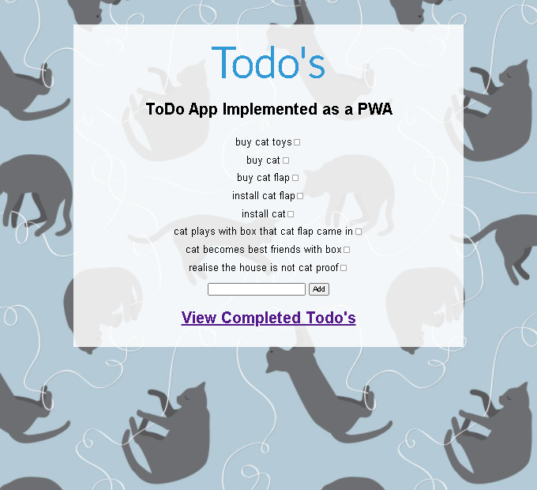

# Existing ToDo App converted to PWA during PWA Workshop in Oct 2020
(PWA = Progressive Web App)

## Run application using built in PHP server

After cloning this repo, run `composer install` to download and install the dependancies.

To run this application using the built in PHP server, `cd` into the root directory and run `composer start`

To run the tests, type  `composer test`

